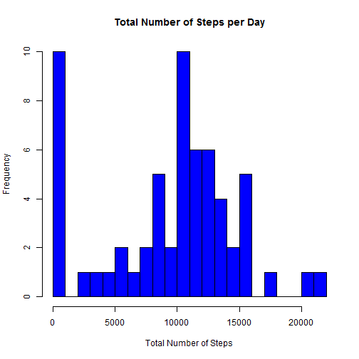
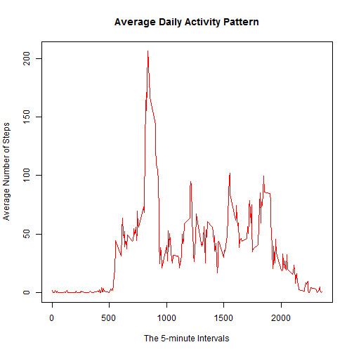
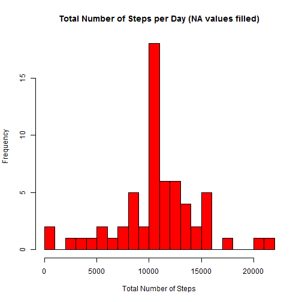
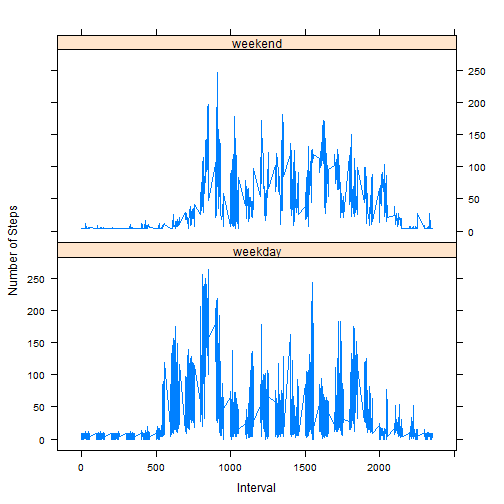

# Reproducible Research: Peer Assessment 1

## Loading and preprocessing the data


```r
if(!exists("activitydata")){
  unzip(zipfile="activity.zip")
  activitydata <- read.csv("./activity.csv", row.names = NULL, nrows=17568, 
                      check.names=F, stringsAsFactors=F, header=T, sep=',', 
                      na.strings="NA", comment.char="", quote='\"')
}
```

## What is mean total number of steps taken per day?

####1.  Making a histogram of the total number of steps taken each day.


```r
totalsteps <- tapply(activitydata$steps, activitydata$date, FUN=sum, na.rm=TRUE)
hist(totalsteps, main="Total Number of Steps per Day", 
     xlab="Total Number of Steps", ylab="Frequency", col="blue", breaks=25)
```

 

#### 2. Calculating and reporting the mean and median of the total number of steps taken per day.


```r
mean(totalsteps, na.rm=TRUE)
```

```
## [1] 9354.23
```

```r
median(totalsteps, na.rm=TRUE)
```

```
## [1] 10395
```

The mean and the median is 9354.23 and 10395 respectively.

## What is the average daily activity pattern?

#### 1. Making a time series plot of the 5-minute interval and the average number of steps taken, averaged across all days.


```r
intaveragesteps <- aggregate(x = list(averagesteps = activitydata$steps), by = list(interval = activitydata$interval), FUN = mean, na.rm = TRUE)
plot(intaveragesteps$interval, intaveragesteps$averagesteps, type="l", col="red", xlab="The 5-minute Intervals", ylab="Average Number of Steps", main="Average Daily Activity Pattern")
```

 

#### 2. Which 5-minute interval, on average across all the days in the dataset, contains the maximum number of steps?


```r
intaveragesteps[which.max(intaveragesteps$averagesteps), ]
```

```
##     interval averagesteps
## 104      835     206.1698
```

The 5-minute interval, on average across all days in the dataset, that contains the maximum number of steps is 835.

## Imputing missing values

#### 1. Calculating and reporting the total number of missing values in the dataset (i.e. the total number of rows with NAs)


```r
(sum(is.na(activitydata$steps)))
```

```
## [1] 2304
```

The total number of missing values in the dataset is 2304.

#### 2. Devise a strategy for filling in all of the missing values in the dataset.

I used a strategy of filling the missing values with a mean of the steps.


```r
NAP <- which(is.na(activitydata$steps))
imputdata <- rep(mean(activitydata$steps, na.rm=TRUE), times=length(NAP))
```

#### 3. Creating a new dataset that is equal to the original dataset but with the missing data filled in.


```r
activitydata[NAP, "steps"] <- imputdata
```

#### 4. Making a histogram of the total number of steps taken each day.


```r
newtotalsteps <- tapply(activitydata$steps, activitydata$date, FUN = sum)
hist(newtotalsteps, main="Total Number of Steps per Day (NA values filled)", 
     xlab="Total Number of Steps", ylab="Frequency", col="red", breaks=25)
```

 

#### Calculating and reporting the mean and median total number of steps taken per day.


```r
mean(newtotalsteps)
```

```
## [1] 10766.19
```

```r
median(newtotalsteps)
```

```
## [1] 10766.19
```

The mean and the median total number of steps taken per day is 10766.19 (both of them).

#### Do these values differ from the estimates from the first part of the assignment? What is the impact of imputing missing data on the estimates of the total daily number of steps?

Yes, these values differ from the estimates from the first part of the assignment.

The impact of imputing missing data on the estimates of the total daily number of steps is that the estimates became higher.

## Are there differences in activity patterns between weekdays and weekends?

#### 1. Creating a new factor variable in the dataset with two levels - "weekday" and "weekend" indicating whether a given date is a weekday or weekend day.

In this part I'll continue to use the NA-filled values dataset.


```r
activitydata$date <- as.POSIXct(activitydata$date, format="%Y-%m-%d")
activitydata <- data.frame(date=activitydata$date, weekday=weekdays(activitydata$date),                                            steps=activitydata$steps, interval=activitydata$interval)
activitydata <- cbind(activitydata, daytype=ifelse(activitydata$weekday == "Saturday" | 
                                                   activitydata$weekday == "Sunday", "weekend", "weekday"))
```

#### 2.Making a panel plot containing a time series plot (i.e. type = "l") of the 5-minute interval (x-axis) and the average number of steps taken, averaged across all weekday days or weekend days (y-axis).


```r
library(lattice)
daytypeaverages <- aggregate(activitydata$steps, by=list(daytype = activitydata$daytype, weekday = activitydata$weekday, interval = activitydata$interval), mean)
xyplot(x ~ interval | daytype, daytypeaverages, type="l", lwd=1, xlab="Interval", ylab="Number of Steps", 
       layout=c(1,2))
```

 
